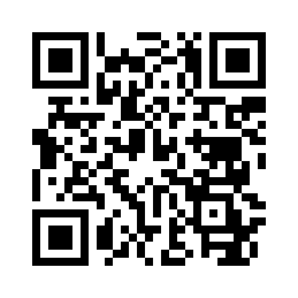

# QR Code Generator



A private, stateless, self-hostable web application for creating
scanner-safe QR codes and exporting them as PNG, JPG, SVG, or PDF.

The project is under active development. User, deployment, and
contributor documentation lives in [`docs/`](docs/index.md) and is
published at <https://geozeke.github.io/qrcode/>.

Release images use the Docker Hub reference
`docker.io/<maintainer-namespace>/qrcode:<version>`, with the namespace
configured by the project maintainer. See the
[getting-started guide](docs/getting-started.md) to deploy a published
image.

## Quick start from source

For a local build from a repository checkout, copy `.env.example` to
`.env`, generate a render-token secret with `openssl rand -hex 32`, and
replace the example secret in `.env`. Then run:

```console
docker compose up --build --detach --wait
```

Open <http://127.0.0.1:8080>. Public deployments should place the app
behind a reverse proxy.

To deploy a published image instead of building the source checkout,
follow the [getting-started guide](docs/getting-started.md). It provides
the copy-ready Compose configuration, image-tag guidance, deployment
verification, and update workflow.

## Documentation

Preview the Zensical documentation locally with:

```console
just docs-serve
```

See the [development guide](docs/development.md) for the complete local
workflow. Release history is recorded in the
[changelog](CHANGELOG.md).

## License

QR Code Generator is available under the [MIT License](LICENSE).
